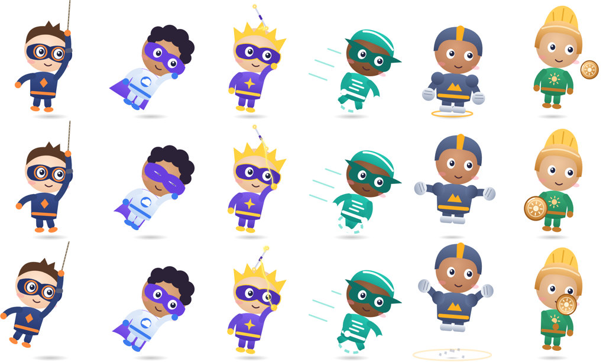

# Animi for Cursor

A tiny desktop companion for macOS. Pick a character, and it watches your cursor and follows it around the screen.


## Contents

- [Characters](#characters)
- [Requirements](#requirements)
- [Install](#install)
- [How to use](#how-to-use)
- [Right-click menu](#right-click-menu)
- [Start automatically at login](#start-automatically-at-login)
- [Update](#update)
- [Uninstall](#uninstall)
- [Troubleshooting](#troubleshooting)
- [Customize](#customize)
- [Contributing](#contributing)
- [License](#license)

## Characters

| | Name | Moves by | Special touches |
|---|---|---|---|
| 🤖 | **Bolt** | flying | thruster flame, swaying antenna, glowing heart |
| 🐱 | **Mochi** | hopping | swishing tail, twitching ears, swinging bell |
| 👻 | **Boo** | floating | rippling hem, waving arms |
| 💧 | **Jelly** | squishing | rising bubbles, leaf sprout |
| 🐧 | **Pip** | waddling | flapping flippers, scarf |
| 🐼 | **Bao** | hopping | bamboo stalk, wiggling ears |

### Heroes

Six original superheroes, in their own **Heroes** menu. Each one does its signature move while it travels after your cursor.



| | Name | Signature move |
|---|---|---|
| 🪝 | **Tether** | Swings across the screen on a grapple line, legs kicking |
| ☁️ | **Cirrus** | Flies fist-first, leaning into the turn, with a streaming cape |
| ⚡ | **Volta** | Spins a storm staff overhead that crackles with sparks |
| 💨 | **Gust** | Super-speed sprint with whirling legs and speed lines |
| ⛰️ | **Rumble** | Giant leaps that land with a shockwave and flying pebbles |
| 🛡️ | **Aegis** | Throws a round shield that boomerangs back to the hand |

All characters and heroes are original designs. They aren't based on any comic, film or game character.

## Requirements

- A Mac running macOS 13 (Ventura) or later.
- Apple's free **Command Line Tools**, which include the Swift compiler. You do not need the full Xcode app.

## Install

All commands below go in the **Terminal** app (press `⌘ Space`, type *Terminal*, press Return).

### 1. Install the Command Line Tools (one time only)

```sh
xcode-select --install
```

A window pops up. Click **Install** and wait for it to finish. If the message says *"command line tools are already installed"*, you're ready.

### 2. Download Animi

Using git:

```sh
git clone https://github.com/Sravankumartangudu/animi-for-cursor.git
cd animi-for-cursor
```

Or without git: on the GitHub page, click the green **Code** button, then **Download ZIP**. Double-click the ZIP to unpack it. Then in Terminal:

```sh
cd ~/Downloads/animi-for-cursor-main
```

### 3. Build the app

```sh
./build.sh
```

The build takes a few seconds and ends with `Built .../Animi.app`.

### 4. Move it to Applications (recommended)

```sh
mv Animi.app /Applications/
```

### 5. Open it

```sh
open /Applications/Animi.app
```

You can also double-click **Animi** in your Applications folder or find it with Spotlight. A small robot appears near the bottom-right of your screen. Move your mouse and it starts following you. 🎉

> Animi doesn't add a Dock icon or a menu-bar icon. To get its menu, right-click the character.

## How to use

| To do this | Do this |
|---|---|
| Make it follow you | Just move the mouse. It travels toward the cursor and stops a little short so it never covers what you're clicking. |
| Move it somewhere | Click and drag the character. |
| Keep it in one place | Right-click → turn off **Follow Cursor**, then drag it where you want. It stays there, even after a restart. |
| Change the character | Right-click → **Character** or **Heroes** → pick one. |
| Make it smaller or bigger | Right-click → **Size** → Tiny / Small / Medium / Large. |
| Get a reaction | **Click** = squish and blink. **Double-click** = hearts and a happy hop. |
| Quit | Right-click → **Quit Animi**. |

Things it does on its own:

- Watches the cursor anywhere on screen. The eyes move first and the head turns after them, and while the cursor rests the eyes glance around now and then.
- Blinks, breathes and bobs.
- Blushes and grins when your cursor comes close.
- Makes a surprised face while you're dragging it.
- Falls asleep (💤) after 30 seconds without mouse movement, and wakes up when you move the mouse.
- Stays above other windows and appears on every desktop (Space), including full-screen apps.

## Right-click menu

| Item | What it does |
|---|---|
| **Character** | Switch between Bolt, Mochi, Boo, Jelly, Pip and Bao. |
| **Heroes** | Switch between Tether, Cirrus, Volta, Gust, Rumble and Aegis. |
| **Follow Cursor** | On: it travels after the cursor. Off: it stays where you put it, but still watches the cursor. |
| **Size** | Tiny, Small (default), Medium or Large. |
| **Say Hi ♥** | Plays the happy animation. |
| **Quit Animi** | Closes the app. |

Your character, size, follow setting and position are saved automatically.

## Start automatically at login

1. Open **System Settings** → **General** → **Login Items & Extensions**.
2. Under **Open at Login**, click **+**.
3. Choose **Animi** from the Applications folder and click **Open**.

## Update

```sh
cd animi-for-cursor
git pull
./build.sh
rm -rf /Applications/Animi.app && mv Animi.app /Applications/
open /Applications/Animi.app
```

If you downloaded a ZIP instead of using git, download the new ZIP and repeat steps 3 to 5 of [Install](#install). Quit Animi first (right-click → **Quit Animi**).

## Uninstall

1. Right-click the character → **Quit Animi**.
2. Delete the app and its saved settings:

```sh
rm -rf /Applications/Animi.app
defaults delete local.animi
```

3. If you added it to Login Items, remove it there too.

## Troubleshooting

**`xcrun: error: invalid active developer path` or `swiftc: command not found`**
The Command Line Tools aren't installed. Run `xcode-select --install` (see Install, step 1).

**`./build.sh: Permission denied`**
Run `chmod +x build.sh`, then `./build.sh` again.

**I can't see the character**
It may be on a monitor you've disconnected, or behind the Dock. Reset its position:

```sh
pkill -x Animi
defaults delete local.animi
open /Applications/Animi.app
```

**It keeps coming back when I try to move it**
That's **Follow Cursor**. Right-click → turn **Follow Cursor** off, then drag it.

**How do I quit it if I can't right-click it?**
Run `pkill -x Animi` in Terminal.

**macOS says the app "can't be opened" or is from an unidentified developer**
This can happen if you copy a built `Animi.app` to another Mac. Right-click the app → **Open** → **Open**. You only need to do this once. Building it yourself with `./build.sh` on the same Mac avoids this.

## Customize

| File | Purpose |
|---|---|
| `animi.html` | All character artwork (SVG) and the shared animation engine |
| `main.swift` | Transparent floating window, cursor tracking, following, dragging, menu |
| `build.sh` | Compiles and bundles `Animi.app` |
| `gallery.html` | Open in a browser to preview every character side by side |

After changing anything, run `./build.sh` and reopen the app.

**Change colors:** each character's colors are near the top of its entry in `CHARS` in `animi.html`. For example, Bolt's eyes are `#5ef2ff` and Mochi's fur is the `ginger` gradient.

**Add a new character:** add an entry to `CHARS` in `animi.html` that uses the shared element ids (`root`, `head`, `face`, `eyeL`/`eyeR`, `eyesHappy`, `eyesSleep`, `eyesWow`, `m_smile`, `m_grin`, `m_o`, `blushL`, `blushR`). Then add it to the `characters` or `heroes` list in `main.swift`. See [CONTRIBUTING.md](CONTRIBUTING.md) for details.

## Contributing

Bug reports, ideas and new characters are welcome. See [CONTRIBUTING.md](CONTRIBUTING.md). Changes in each version are listed in [CHANGELOG.md](CHANGELOG.md).

## License

[MIT](LICENSE) © 2026 Sravankumartangudu. You're free to use, change and share it. All characters are original designs.
