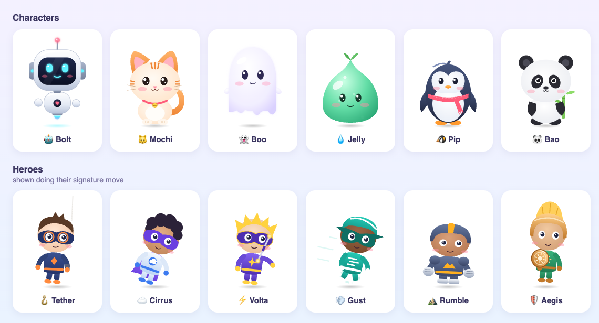

# Animi for Cursor

A tiny desktop companion for macOS. Pick a character, and it watches your cursor and follows it around the screen.



## Characters

| | Name | Moves by | Special touches |
|---|---|---|---|
| 🤖 | **Bolt** | flying | thruster flame, swaying antenna, glowing heart |
| 🐱 | **Mochi** | hopping | swishing tail, twitching ears, swinging bell |
| 👻 | **Boo** | floating | rippling hem, waving arms |
| 💧 | **Jelly** | squishing | rising bubbles, leaf sprout |
| 🐧 | **Pip** | waddling | flapping flippers, scarf |
| 🐼 | **Bao** | hopping | bamboo stalk, wiggling ears |

## What it does

- Its eyes and head follow your cursor, anywhere on screen.
- It travels toward the cursor and stops just short, so it never covers what you're clicking.
- **Drag** it anywhere. It makes a surprised face while you hold it.
- **Click** it for a squish and a blink. **Double-click** for hearts and a happy hop.
- It blushes and grins when the cursor is close, and falls asleep after 30 seconds of no mouse movement.
- It stays on top of other windows, appears on every desktop (Space), and doesn't add a Dock icon.

**Right-click** it for the menu: Character, Follow Cursor (on/off), Size (Tiny / Small / Medium / Large), Say Hi ♥, and Quit. Your choices and its position are remembered.

Tip: to park it in one spot, turn **Follow Cursor** off and drag it where you want it.

## Build and run

Requires macOS and the Xcode Command Line Tools (`xcode-select --install`).

```sh
./build.sh
open Animi.app
```

## Files

| File | Purpose |
|---|---|
| `animi.html` | All character artwork (SVG) and the shared animation engine |
| `main.swift` | Transparent floating window, cursor tracking, following, dragging, menu |
| `build.sh` | Compiles and bundles `Animi.app` |
| `gallery.html` | Open in a browser to preview every character side by side |

## Adding a character

Add an entry to `CHARS` in `animi.html` that uses the shared element ids (`root`, `head`, `face`, `eyeL`/`eyeR`, `eyesHappy`, `eyesSleep`, `eyesWow`, `m_smile`, `m_grin`, `m_o`, `blushL`, `blushR`). Then add it to the `characters` list in `main.swift`.
